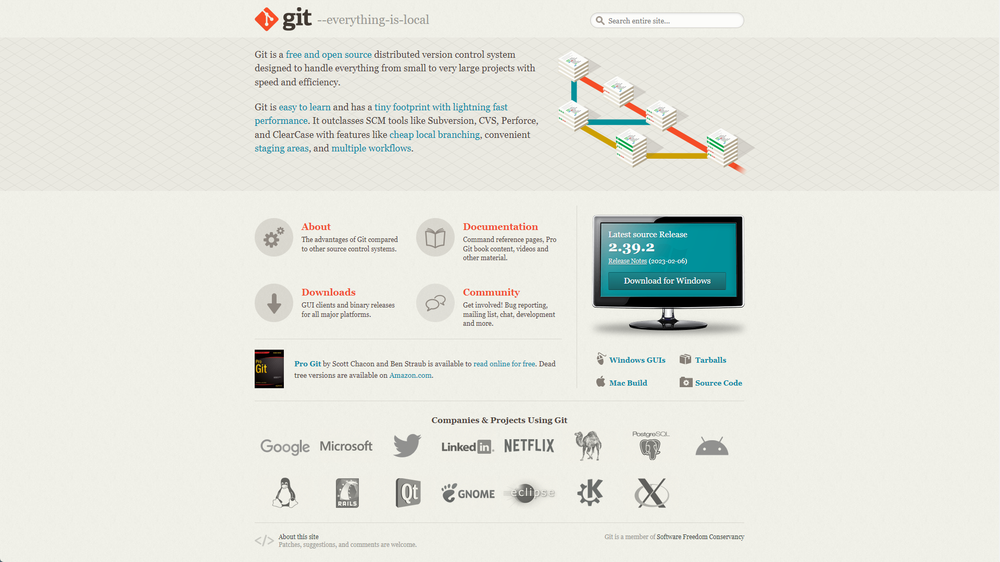
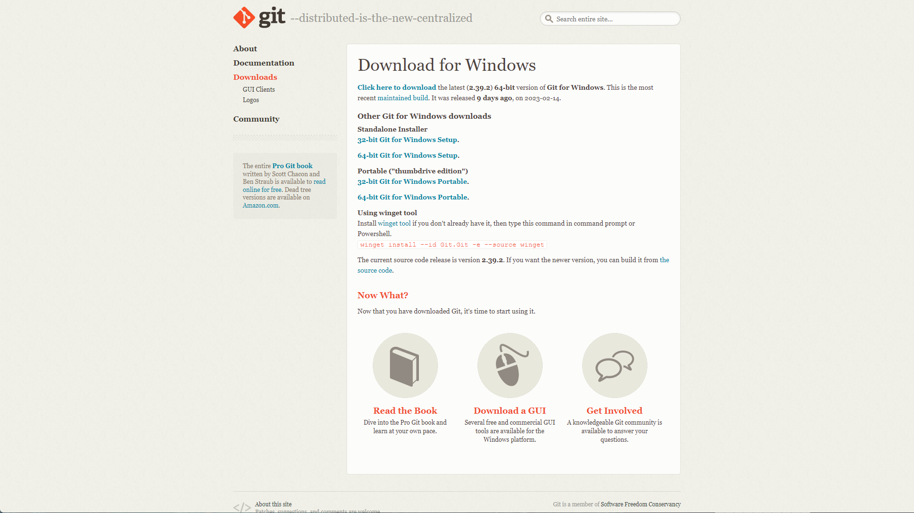

# Get Start with Git

## Git 下载与安装

访问 [*Git* 官网][Git-scm] 

中部偏右的蓝色区域会显示最新的 *Git* 版本号。
点击下方的 `Download for Windows` 将跳转至下载页。
> 此项可能会因为平台不同而产生内容差异，此指南以 *Windows* 为例。

点击最上方的超链接 `Click here to download` 即可下载适配您目前环境的最新版 *Git* 的安装包。

运行下载得到的 *Git* 安装程序，以下内容会对几个值得注意的点稍加讲解。
> 逐步安装指南请参阅 [此处](./VSCode-Install-Step-by-Step.md)

[Git-scm]: https://git-scm.com/
