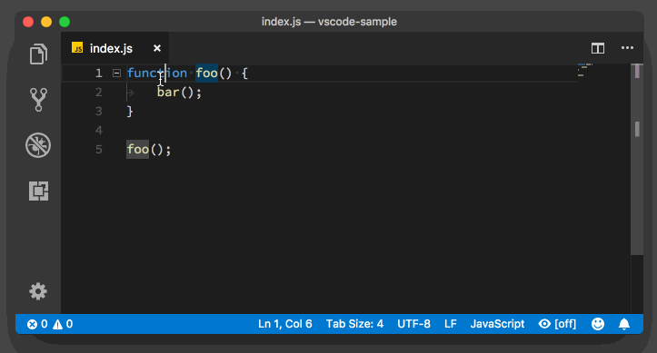
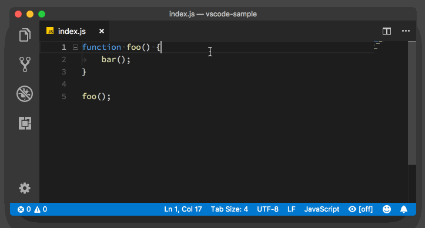

# VSCode Advanced

## 界面概览

在初次启动 *VSCode* 时，会出现如下欢迎界面。

根据你的个人需求，你可以跟随软件提示完成设置，或是点击左上角 `欢迎` ，来到*VSCode*的常规界面。

你可以尝试点击和访问这个界面上的各种链接和按钮，来了解和学习 *VSCode* 的各种功能。当然也可以访问 [*VSCode* 官方文档][VSCode-doc] 来详细了解*VSCode*的各种功能特性。接下来主要介绍三个部分：[**基本操作**](#基本操作)、[**键盘指令**](#键盘操作)、[**插件推荐**](#推荐插件)。

[VSCode-doc]: https://code.visualstudio.com/docs

## 基本操作

### 界面概览

首先来了解一下 *VSCode* 默认界面。

这张图片展示了 *VSCode* 的默认界面中不同模块的位置、名称和快捷键。它可以很好的帮助初学者渡过最初的不适应阶段，为后续的纯键盘操作打下基础。

### 命令面板

在 *VSCode* 中，你可以通过命令面板来执行各种操作。你可以通过按 `F1` 或者使用 `Ctrl + Shift + P` / `Cmd + Shift + P` 打开命令面板。

在命令面板中，你可以快速搜索你想要执行的命令，然后按下 `Enter` 键来执行。比如，你可以输入 `>Open Settings (UI)` 来打开设置面板。熟练使用命令面板，可以实现摆脱鼠标，通过键盘来完成所有操作，这将大大提高你的工作效率。

## 键盘指令

## 键盘指令

### 常用快捷键
*VS Code*中有很多快捷键，这里只介绍一些常用的快捷键。

例如：觉得快捷键太多记不住？可以访问[快捷键参考](https://code.visualstudio.com/shortcuts/keyboard-shortcuts-windows.pdf)来查阅基本快捷键

或者是使用`Ctrl + K Ctrl + S`来查看和绑定*VSCode*中所有快捷键。

接下来列举一些使用频率很高的快捷键：
| 功能             | 快捷键             |
| ---------------- | ------------------ |
| 打开命令面板     | `Ctrl + Shift + P` |
| 打开设置面板     | `Ctrl + ,`         |
| 打开搜索面板     | `Ctrl + Shift + F` |
| 打开文件         | `Ctrl + P`         |
| 打开终端         | `Ctrl + ~`         |
| 打开侧边栏       | `Ctrl + B`         |
| 启动调试         | `F5`               |
| 打开Markdown预览 | `Ctrl + Shift + V` |
| 关闭当前标签页   | `Ctrl + W`         |
| 格式化代码       | `Shift + Alt + F`  |
| 保存文件         | `Ctrl + S`         |

### 编辑技巧

#### 光标移动

常见的移动光标方法是按方向键，但是其效率在有大量文本的情况下会很低。*VSCode*提供了一些高级的光标移动方法，可以大大提高你的工作效率。

首先介绍一下**针对单词的光标移动**

[图源](http://img.geek-docs.com/vscode/keyboard/keyboard-1.gif)

如图所示
光标位于单词中间时，使用`Ctrl+←`可以将光标移动到单词首，同理可得，`Ctrl+→`可以将光标移动到单词尾。

这就引申出了另一个技巧。我们都知道，长按方向键，可以让光标一个字符一个字符地在文本中移动。这时候光标的移动粒度是一个字符。
如果我们在移动的过程中，按下`Ctrl+方向键`，那么光标的移动粒度就变成了一个单词，这时候，我们就可以在文本中以单词为单位快速移动光标了。

[图源](http://img.geek-docs.com/vscode/keyboard/keyboard-2.gif)

**快速移动至行首/行尾**
|            |        |
| ---------- | ------ |
| 移动至行首 | `Home` |
| 移动至行尾 | `End`  |

**快速移动至文档首/文档尾**
|            |             |
| ---------- | ----------- |
| 移动至首行 | `Ctrl+Home` |
| 移动至尾行 | `Ctrl+End`  |

**代码块跳转**

Windows快捷键 `Ctrl+Shift+\`

[图源](http://img.geek-docs.com/vscode/keyboard/keyboard-4.gif)

常用于`for`、`if`、`while`和函数定义等代码块始末的跳转，一般是在花括号 ` { ` 和 ` } `之间跳转。

#### 文本编辑
<!--
TODO
-->

#### 高级技巧

通过上方菜单**帮助>编辑器操场**来打开交互式演练场。

如图所示，在这个页面中，你可以通过各种交互示例来练习VSCode的各种高级编辑技巧。

这里着重介绍几个使用频率很高的技巧。

[**多光标编辑**](#多光标编辑) - 代码块选择，多行选中，添加多个光标等功能

[**代码折叠/展开**](#代码折叠/展开) - 通过折叠代码块，可以让你的代码更加清晰、易读。

[**重命名和重构**](#重命名和重构) - 快速重命名整个代码库中相应的变量、函数或任何你想要的东西。

[**代码行操作**](#代码行操作) - 快速操作代码行，比如复制、删除、移动等。

##### **多光标编辑**

使用`Shift+Alt+鼠标左键`来添加多个光标同时选定部分文本，
此时可以同时编辑多个光标所在的行。

[图源](https://code.visualstudio.com/assets/docs/editor/codebasics/multicursor.gif)

上述操作涉及了部分的鼠标操作，但是*VSCode*也提供了键盘操作来实现同样的效果。

通过`Ctrl+Alt+↑`或`Ctrl+Alt+↓`可以添加多个光标，接着可以通过`Shift+方向键`来实现选中。

当需要同时编辑多个相同符号时，可以按下`Ctrl+Shift+L`在该符号范围内添加多个光标。

##### **代码折叠/展开**

##### **重命名和重构**

##### **代码行操作**

## 插件推荐