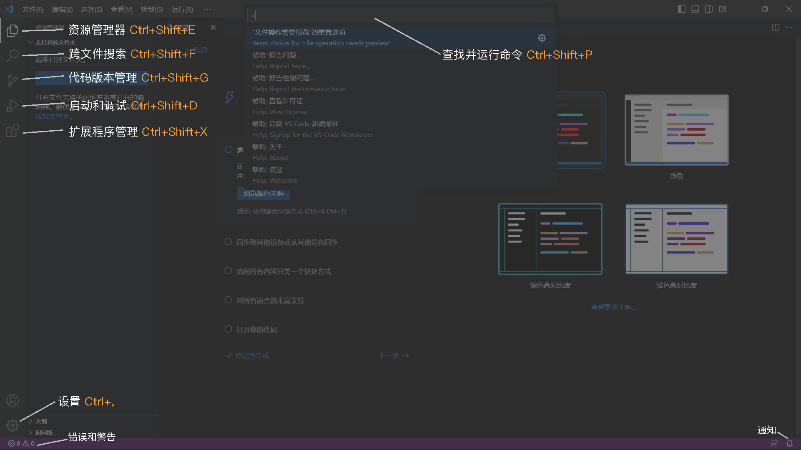
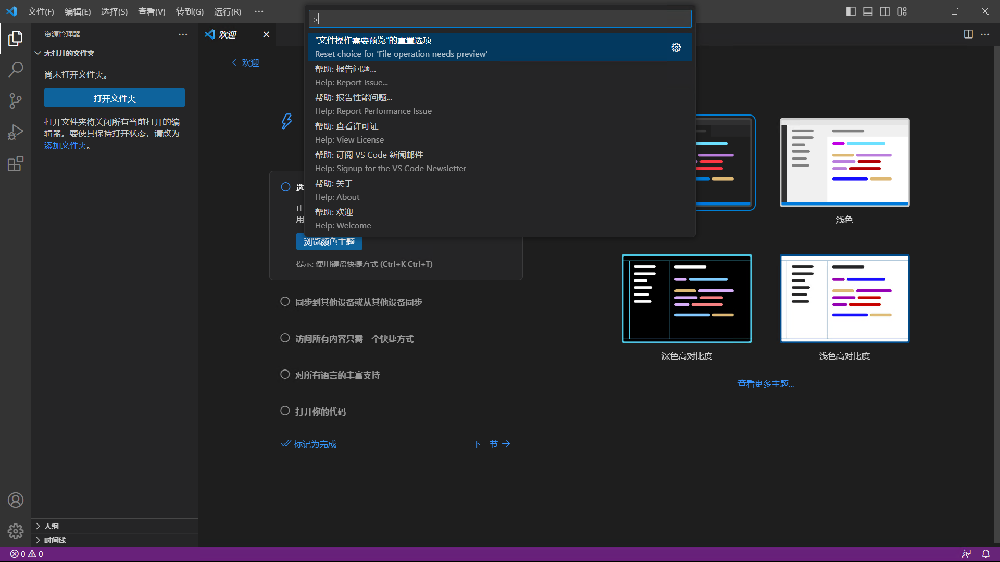
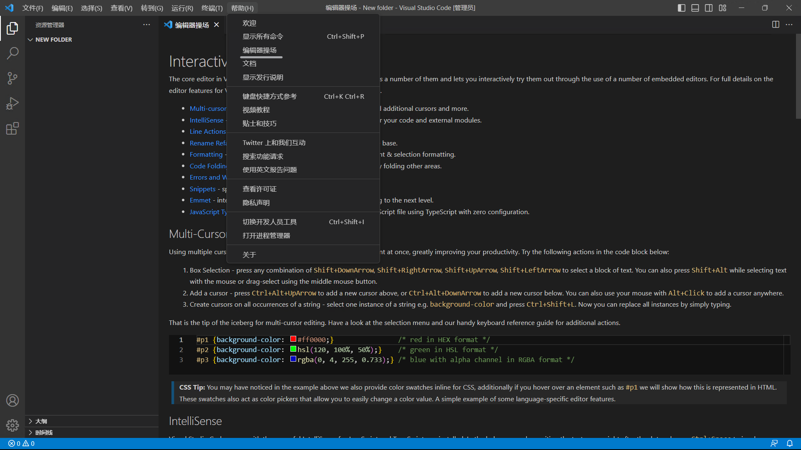

# VSCode Advanced

## 界面概览

在初次启动 *VSCode* 时，会出现如下欢迎界面。

根据你的个人需求，你可以跟随软件提示完成设置，或是点击左上角 `欢迎` ，来到*VSCode*的常规界面。

你可以尝试点击和访问这个界面上的各种链接和按钮，来了解和学习 *VSCode* 的各种功能。当然也可以访问 [*VSCode* 官方文档][VSCode-doc] 来详细了解*VSCode*的各种功能特性。接下来主要介绍三个部分：[**基本操作**](#基本操作)、[**键盘指令**](#键盘操作)、[**插件推荐**](#推荐插件)。

[VSCode-doc]: https://code.visualstudio.com/docs

## 基本操作

### 界面概览

首先来了解一下 *VSCode* 默认界面。

这张图片展示了 *VSCode* 的默认界面中不同模块的位置、名称和快捷键。它可以很好的帮助初学者渡过最初的不适应阶段，为后续的纯键盘操作打下基础。

### 命令面板

在 *VSCode* 中，你可以通过命令面板来执行各种操作。你可以通过按 `F1` 或者使用 `Ctrl + Shift + P` / `Cmd + Shift + P` 打开命令面板。

在命令面板中，你可以快速搜索你想要执行的命令，然后按下 `Enter` 键来执行。比如，你可以输入 `>Open Settings (UI)` 来打开设置面板。熟练使用命令面板，可以实现摆脱鼠标，通过键盘来完成所有操作，这将大大提高你的工作效率。

## 键盘指令

## 键盘指令

### 常用快捷键
*VS Code*中有很多快捷键，这里只介绍一些常用的快捷键。

例如：觉得快捷键太多记不住？可以访问[快捷键参考](https://code.visualstudio.com/shortcuts/keyboard-shortcuts-windows.pdf)来查阅基本快捷键

或者是使用`Ctrl + K Ctrl + S`来查看和绑定*VSCode*中所有快捷键。

接下来列举一些使用频率很高的快捷键：
| 功能 | 快捷键 |
| --------------- | -------------- |
| 打开命令面板 | `Ctrl + Shift + P` |
| 打开设置面板 | `Ctrl + ,` |
| 打开搜索面板 | `Ctrl + Shift + F` |
| 打开文件 | `Ctrl + P` |
| 打开终端 | `Ctrl + ~` |
| 打开侧边栏 | `Ctrl + B` |
| 启动调试 | `F5` |
| 打开Mardown预览 | `Ctrl + Shift + V` |
| 关闭当前标签页 | `Ctrl + W` |
| 格式化代码 | `Shift + Alt + F` |
| 保存文件 | `Ctrl + S` |

### 编辑技巧

#### 光标移动
<!--
TODO
-->

#### 文本编辑
<!--
TODO
-->

#### 多光标编辑
通过上方菜单**帮助>编辑器操场**来打开交互式演练场。

如图所示，在这个页面中，你可以通过各种交互示例来练习VSCode的各种高级编辑技巧。

## 插件推荐