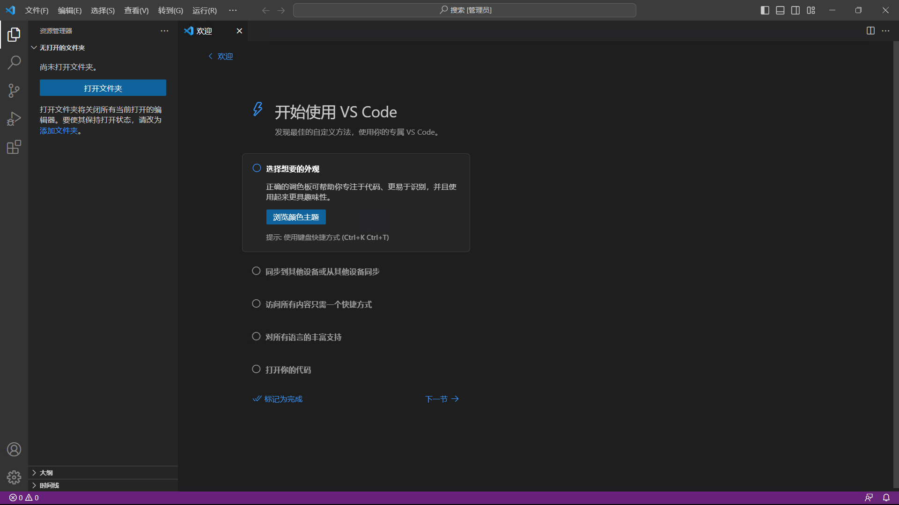
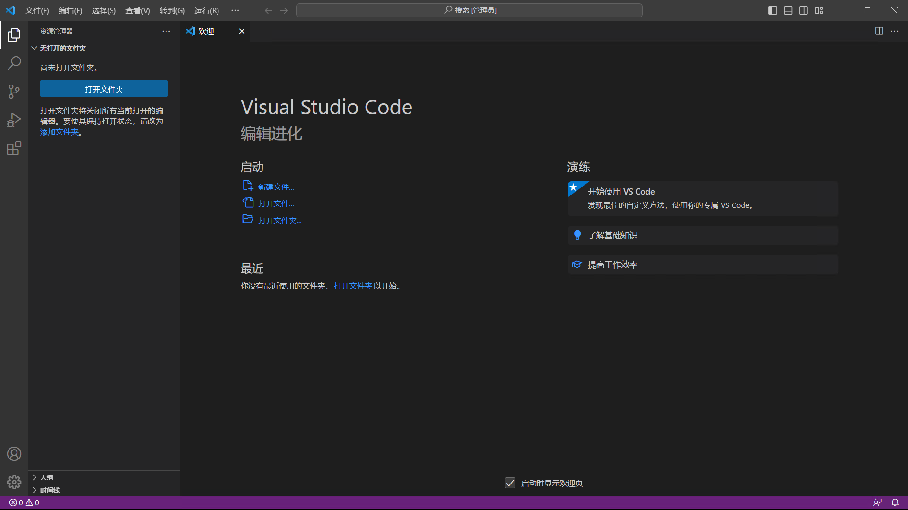

# VSCode-Advanced

## 界面概览

在初次启动 *VSCode* 时，会出现如下欢迎界面。

根据你的个人需求，你可以跟随软件提示完成设置，或是点击左上角`欢迎`，来到*VSCode*的常规界面。

你可以尝试点击和访问这个界面上的各种链接和按钮，来了解和学习 *VSCode* 的各种功能。当然也可以访问 [*VSCode* 官方文档](https://code.visualstudio.com/docs)]来详细了解*VSCode*的各种功能特性。接下来主要介绍三个部分：**基本操作**、**键盘操作**、**推荐插件**。

## 基本操作

### 命令面板

~~首先来了解一下 *VSCode* 的命令面板。~~
在 *VSCode* 中，你可以通过命令面板来执行各种操作。你可以通过按`F1`或者使用`Ctrl+Shift+P`/`Cmd+Shift+P`打开命令面板。

在命令面板中，你可以快速搜索你想要执行的命令，然后按下`Enter`键来执行。比如，你可以输入`>Open Settings (UI)`来打开设置面板。熟练使用命令面板可以大大提高你的工作效率。

### 键盘操作

## 推荐插件